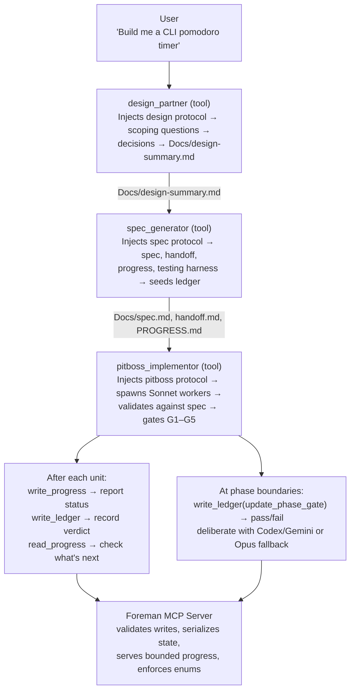
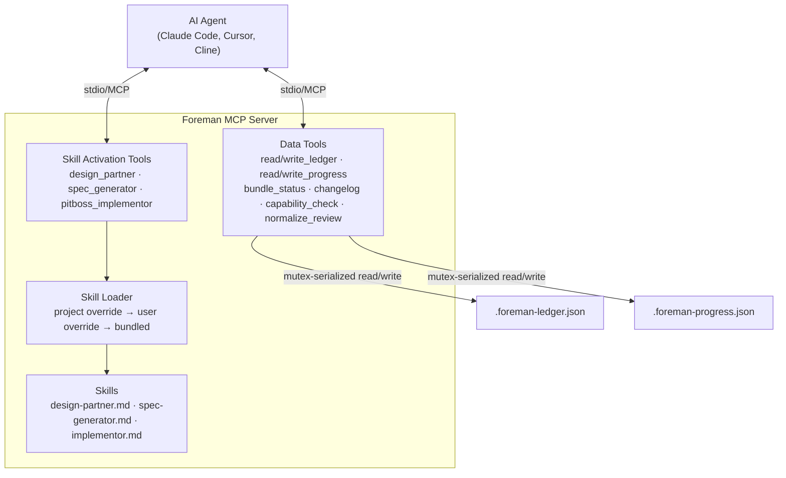

<p align="center">
  
</p>

<p align="center">
  <a href="https://github.com/malindarathnayake/foreman/actions/workflows/build.yml"></a>
  <a href="LICENSE"></a>
  <a href="https://nodejs.org/"></a>
</p>

**An MCP server that adds structured progress tracking, phase gates, and implementation audit trails to AI coding agents.**

---

## Why This Exists

AI coding agents (Claude Code, Cursor, Cline) are good at writing code but bad at staying on track. On multi-file, multi-phase projects they lose context across sessions, skip steps, may lose state after crashes, and leave no structured audit trail at the project level.

No existing tool combines all of these in a single MCP server:

- **Mutex-serialized writes** — concurrent subagents can't corrupt shared state
- **Enum-typed operations with schema validation** — `"staus"` is rejected at the tool level, not discovered 3 phases later
- **Bounded context reads** — `read_progress` returns ~400 tokens, not an unbounded file
- **Phase gates as first-class operations** — pass/fail checkpoints enforced between phases
- **Compact JSON ledger** — structured audit trail across sessions, across crashes
- **Skill activation tools** — design-partner, spec-generator, and implementor protocols injected into LLM context on demand via tool calls
- **Portable** — works with Claude Code, Cursor, Cline, or any MCP client

### Why not just a skill?

Skills are markdown prompts — they tell the agent *what to do* but can't enforce *that it does it*. A skill can say "update PROGRESS.md after each unit" but the agent can forget, hallucinate the update, or silently skip it. There's no validation layer.

The skills provide the *workflow* (design → spec → implement → gate). The MCP server provides the *infrastructure* that makes the workflow reliable — validated writes, bounded reads, concurrent safety, and agent portability. This is all possible with skills alone. But MCP made sense as the distribution format: one `npx` command gives any MCP-compatible agent the full workflow with validated state tracking, instead of copying markdown files between projects.

### How Foreman Compares

Most AI coding tools are either plumbing (single-purpose MCP servers) or single-shot executors (write code from a prompt). None enforce a design-before-code pipeline with independent review and persistent audit trails.

| Feature | Foreman | MCP Servers | Cursor/Windsurf/Cline | Codex CLI | Devin/SWE-Agent |
|---------|---------|-------------|----------------------|-----------|-----------------|
| Design before code | Enforced stage | N/A | Optional/skipped | No | Skipped |
| Independent review | Codex + Gemini (different models) | N/A | Same model self-review | N/A | Same agent |
| Audit trail (ledger) | Built in | None | None | None | None |
| Session persistence | Progress + ledger survive restarts | Stateless | Lost on new session | Single-shot | Partial |
| Pit-boss/worker separation | Opus validates, Sonnet writes | N/A | Same agent does both | Single agent | Same agent |
| MCP-delivered, locally overridable | Yes | Hardcoded | Hardcoded | N/A | Hardcoded |
| Multi-model deliberation | Codex + Gemini + Opus at phase gates | No | No | No | No |

Foreman is a software development governance layer — it doesn't write code, it supervises agents that do and ensures they follow the spec.

### How it works: the Pitboss architecture

Foreman follows a **pitboss/worker** model — the Foreman doesn't write code, it supervises agents that do.



The **skill activation tools are the pipeline** — each tool injects a protocol that the LLM follows. The **pitboss never writes code** — it spawns disposable Sonnet workers and validates their output. The **MCP server is the foreman** — it holds the ledger, validates every status update, and ensures workers can't corrupt shared state.

**~750 tokens idle overhead. 11 tools. 3 skills loaded on-demand.**

---

## Quick Start

### 1. Install

**Option A: Local install (no auth required)**

Download the pre-built tarball from the repo and install directly:

```bash
curl -LO https://github.com/malindarathnayake/Foreman/raw/main/artifacts/malindarathnayake-foreman-mcp-0.0.4.tgz
npm install -g malindarathnayake-foreman-mcp-0.0.4.tgz
```

**Option B: GitHub Packages registry**

```bash
npm install -g @malindarathnayake/foreman-mcp
```

> Requires a one-time `.npmrc` setup:
> ```
> echo "@malindarathnayake:registry=https://npm.pkg.github.com" >> ~/.npmrc
> echo "//npm.pkg.github.com/:_authToken=YOUR_GITHUB_TOKEN" >> ~/.npmrc
> ```
> Generate a token at **Settings > Developer settings > Personal access tokens** with `read:packages` scope.

### 2. Configure your agent

Add Foreman to your MCP settings:

<details>
<summary><strong>Claude Code</strong> (~/.claude/settings.json)</summary>

If installed globally:
```json
{
  "mcpServers": {
    "foreman": {
      "command": "foreman-mcp"
    }
  }
}
```

Via npx (no install):
```json
{
  "mcpServers": {
    "foreman": {
      "command": "npx",
      "args": ["-y", "@malindarathnayake/foreman-mcp"]
    }
  }
}
```

On Windows, prefix with `cmd`:
```json
{
  "mcpServers": {
    "foreman": {
      "command": "cmd",
      "args": ["/c", "foreman-mcp"]
    }
  }
}
```
</details>

<details>
<summary><strong>Cursor</strong> (.cursor/mcp.json)</summary>

```json
{
  "mcpServers": {
    "foreman": {
      "command": "npx",
      "args": ["-y", "@malindarathnayake/foreman-mcp"]
    }
  }
}
```
</details>

<details>
<summary><strong>Cline</strong> (MCP settings)</summary>

```json
{
  "mcpServers": {
    "foreman": {
      "command": "npx",
      "args": ["-y", "@malindarathnayake/foreman-mcp"]
    }
  }
}
```
</details>

### 3. Use

```
> call the foreman design_partner tool      # Interactive design session
> call the foreman spec_generator tool      # Generate implementation docs
> call the foreman pitboss_implementor tool # Execute the plan unit-by-unit
```

That's it. Foreman tracks progress, enforces phase gates, and logs everything to a compact ledger — across sessions, across crashes.

---

## What It Does

### Skill Activation Tools (3 tools — the Foreman pipeline)

| Tool | Purpose |
|------|---------|
| `design_partner` | Activates collaborative design session — scoping questions, push-back, YIELD directives, multi-model deliberation |
| `spec_generator` | Activates spec generation — transforms design summary into spec, handoff, progress, testing harness; seeds ledger |
| `pitboss_implementor` | Activates pitboss/worker orchestration — spawns Sonnet workers, validates against spec, runs gates G1-G5 |

Each tool pipes its full skill protocol into the LLM's context when called. Skills are also available as MCP resources (`skill://foreman/<name>`) for backward compatibility.

### Data Tools (8 tools — enum-typed operations)

| Tool | Purpose |
|------|---------|
| `bundle_status` | Server version and override info |
| `changelog` | Version history |
| `read_ledger` | Query unit status, verdicts, rejections, phase gates |
| `write_ledger` | Record unit status, verdicts, rejections, gate results |
| `read_progress` | Bounded progress view (truncated to last N completed + all incomplete) |
| `write_progress` | Start phases, update status, complete units, log errors |
| `capability_check` | Verify external CLI tools are available |
| `normalize_review` | Structure code review findings for remediation planning |

---

## Architecture



**Stack:** TypeScript (ESM) · `@modelcontextprotocol/sdk` · Zod
**Transport:** stdio (MCP standard)
**State:** Local JSON files in the project directory

**How skill activation works:** The LLM calls a skill activation tool (e.g. `design_partner`). The tool resolves the skill file through a 3-tier override chain (project-local → user-global → bundled), and returns the full protocol as the tool response. The protocol is now in the LLM's context and it follows the instructions — no resource URIs, no extra steps.

**Token efficiency:** Compact single-line JSON with short keys, TOON (plain-text) tool responses, bounded progress truncation, and skill protocols loaded only when the tool is called.

---

## Skill Overrides

When a skill activation tool is called, the skill loader checks for local overrides before falling back to the bundled version:

```
.claude/skills/<skill-name>/SKILL.md        # project-local (highest priority)
~/.claude/skills/<skill-name>/SKILL.md      # user-global
<bundled>/skills/<skill-name>.md            # packaged default
```

Override names match the skill file: `design-partner`, `spec-generator`, `implementor`.

---

## Development

```bash
git clone https://github.com/malindarathnayake/foreman.git
cd foreman/foreman-mcp
npm install
npm run build
npm test          # 103 tests across 8 files
```

---

## License

[AGPL-3.0](LICENSE) — Copyright (c) 2026 Malinda Rathnayake
