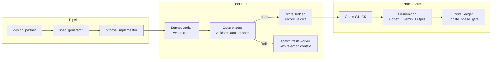
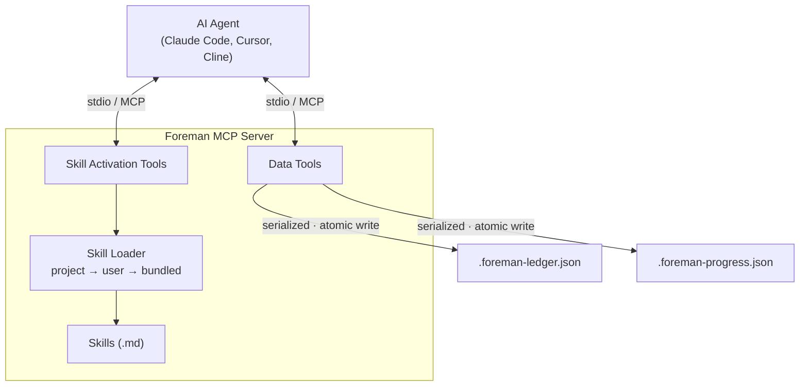

<p align="center">
  
</p>

<p align="center">
  <a href="https://github.com/malindarathnayake/foreman/actions/workflows/build.yml"></a>
  <a href="LICENSE"></a>
  <a href="https://nodejs.org/"></a>
</p>

**A software development governance layer for AI coding agents.** Foreman enforces a design → spec → implement pipeline, validates every state change through a structured ledger, and uses independent models (Codex, Gemini) to review work at phase gates. It doesn't write code — it supervises agents that do.

**11 tools. 3 skill protocols. ~750 tokens idle overhead.**

---

## Quick Start

### Install

```bash
curl -LO https://github.com/malindarathnayake/Foreman/raw/main/artifacts/malindarathnayake-foreman-mcp-0.0.4.tgz
npm install -g malindarathnayake-foreman-mcp-0.0.4.tgz
```

Or via GitHub Packages: `npm install -g @malindarathnayake/foreman-mcp` ([setup](https://docs.github.com/en/packages/working-with-a-github-packages-registry/working-with-the-npm-registry#authenticating-to-github-packages))

### Configure

Add to your MCP settings (`~/.claude/settings.json`, `.cursor/mcp.json`, or Cline config):

```json
{
  "mcpServers": {
    "foreman": {
      "command": "foreman-mcp"
    }
  }
}
```

<details>
<summary>Other install methods (npx, Windows)</summary>

Via npx (no install):
```json
{ "mcpServers": { "foreman": { "command": "npx", "args": ["-y", "@malindarathnayake/foreman-mcp"] } } }
```

Windows:
```json
{ "mcpServers": { "foreman": { "command": "cmd", "args": ["/c", "foreman-mcp"] } } }
```
</details>

### Use

```
> call the foreman design_partner tool      # workshop the design
> call the foreman spec_generator tool      # generate spec + handoff + progress + test harness
> call the foreman pitboss_implementor tool # implement unit-by-unit with worker agents
```

---

## How It Works



Each skill activation tool injects a protocol into the LLM's context when called. The LLM follows the protocol — it doesn't need to figure out which tools to use or in what order.

| Stage | Tool | What happens |
|-------|------|-------------|
| **Design** | `design_partner` | Scoping questions, push-back on vague requirements, YIELD directives that force the LLM to stop and wait for user input, multi-model deliberation on ambiguities |
| **Spec** | `spec_generator` | Transforms design summary into 4 docs (spec, handoff, progress, testing harness), seeds ledger with phase/unit structure |
| **Implement** | `pitboss_implementor` | Spawns disposable Sonnet workers per unit, validates output against spec, runs self-review gates G1-G5, deliberates with Codex/Gemini at phase boundaries |

**The pitboss never writes code.** It reads the spec, builds a brief, spawns a worker, validates the result, and records the verdict. If the worker fails, it's killed and a fresh one gets the rejection context.

---

## What Makes This Different

The AI coding landscape in 2026 has matured — Cursor has Plan Mode, Codex CLI has session persistence, Devin can orchestrate child agents. But none enforce a design-before-code pipeline with cross-model deliberation and a structured audit ledger.

| | Foreman | Cursor 3 | Codex CLI | Devin |
|---|---------|----------|-----------|-------|
| **Design before code** | Enforced | Optional (Plan Mode) | No | Needs upfront spec |
| **Independent review** | Codex + Gemini (different models) | BugBot (same model, 8 passes) | Same model | Same agent |
| **Structured ledger** | Verdicts, rejections, phase gates | Enterprise audit logs | SQLite session threads | Session logs |
| **Writer/reviewer split** | Opus validates, Sonnet writes | Same agent | Same agent | Same agent |
| **Multi-model deliberation** | Per phase completion (optional, skippable) | `/best-of-n` (no gates) | No | Same model |

---

## Tools Reference

### Skill Activation (3 tools)

| Tool | Protocol injected |
|------|-------------------|
| `design_partner` | Collaborative design session with YIELD checkpoints |
| `spec_generator` | Spec generation + ledger/progress seeding |
| `pitboss_implementor` | Pitboss/worker orchestration with G1-G5 gates |

### Data (8 tools)

| Tool | Purpose |
|------|---------|
| `read_ledger` / `write_ledger` | Unit status, verdicts, rejections, phase gates |
| `read_progress` / `write_progress` | Bounded progress view, phase management |
| `bundle_status` | Server version and override info |
| `changelog` | Version history |
| `capability_check` | Check if Codex/Gemini CLI is available |
| `normalize_review` | Parse review findings into structured format |

---

## Architecture



**Stack:** TypeScript (ESM) · `@modelcontextprotocol/sdk` · Zod · stdio transport

### Skill overrides

When a skill tool is called, the loader checks for local overrides first:

```
.claude/skills/<skill-name>/SKILL.md        # project-local (highest priority)
~/.claude/skills/<skill-name>/SKILL.md      # user-global
<bundled>/skills/<skill-name>.md            # packaged default
```

---

## Why This Exists

AI coding agents are good at writing code but bad at governance. On multi-file projects they lose context across sessions, skip design, self-review their own work, and leave no audit trail. Skills alone can't fix this — a skill can say "update the ledger after each unit" but the agent can forget or hallucinate the update.

Foreman separates the concerns:
- **Skills** provide the workflow (design → spec → implement → gate)
- **MCP tools** provide the infrastructure (validated writes, bounded reads, mutex serialization, enum schemas)
- **The ledger** provides the audit trail (survives crashes, sessions, and context resets)

One `npm install` gives any MCP-compatible agent the full pipeline.

---

## FAQ

**Isn't the pitboss just an LLM grading another LLM's homework?**

No. The pitboss re-runs the test command itself and reads stdout/stderr — it does not trust the worker's self-report (`implementor.md`, step 6). A unit cannot pass unless the tests actually execute and exit clean. On top of that, five named gates (G1–G5) check contract completeness, assertion integrity, spec fidelity, test-suite impact, and worker hygiene — several via deterministic grep/pattern matching, not LLM judgment. At phase boundaries the full test suite runs again before the phase gate can flip to `pass`. The LLM review layer handles *semantic* validation (does the code implement what the spec describes?) which static analysis and tests cannot cover.

**Doesn't a flat JSON ledger fall over with parallel workers?**

The architecture is single-writer by design. Workers never touch the ledger — only the pitboss writes verdicts after validating each unit. Writes are serialized via a per-path promise-chain lock and use atomic `.tmp`→`rename` to prevent partial corruption. There is no fan-out write contention because the pitboss dispatches units sequentially: dispatch → worker executes → pitboss validates → write ledger → next unit.

**Multi-model deliberation at every gate must be incredibly slow and expensive.**

Deliberation runs once per *phase completion*, not per unit. A 3-phase project triggers ~3 deliberation sessions total. It is also conditional: if Codex/Gemini CLIs aren't installed, the pitboss asks the user whether to proceed without them. Users can skip deliberation entirely with "skip council." The ~750 token idle overhead is the MCP server's baseline; active deliberation cost scales with the number of phases, not units.

**Why not replace the Opus validation entirely with CI/CD?**

Tests and linters answer "does it compile and pass assertions." They cannot answer "did you implement the requirement the spec describes" or "does this integration break the contract from a prior unit." Semantic validation — checking that code *means* what the spec *says* — is the gap the LLM review fills. Foreman layers both: deterministic gates first (tests, pattern matching), then LLM review for what automation can't catch.

**What happens if the context window resets mid-implementation?**

The ledger and progress files survive on disk. A new session reads them back and resumes from the last recorded state. Completed units keep their verdicts; in-progress units restart with the rejection history intact.

---

## Development

```bash
git clone https://github.com/malindarathnayake/foreman.git
cd foreman/foreman-mcp
npm install
npm run build
npm test          # 103 tests across 8 files
```

---

## License

[AGPL-3.0](LICENSE) — Copyright (c) 2026 Malinda Rathnayake
