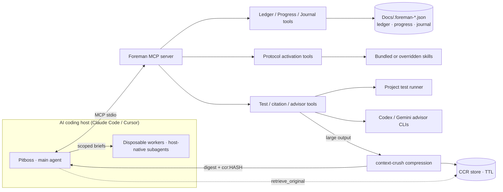

<p align="center">
  
</p>

<p align="center">
  <a href="https://github.com/malindarathnayake/foreman/actions/workflows/build.yml"></a>
  <a href="LICENSE"></a>
  <a href="https://nodejs.org/">= 22" /></a>
</p>

# Foreman

Foreman is an MCP governance layer for AI coding agents. It turns engineering process into tools: design sessions, specs, ledgers, phase gates, worker handoffs, test execution, citation checks, and review councils.

It does not replace Claude Code, Cursor, Codex, Gemini, or your test suite. It gives them a control plane so long-running coding work has durable state, evidence, and explicit stop points.

**Current release:** `v0.2.2`  
**Package:** `@malindarathnayake/foreman-mcp`  
**Runtime:** Node.js `>=22`  
**License:** AGPL-3.0-only

---

## Why Foreman Exists

Large agent coding sessions fail in boring ways:

- the model drifts from the original plan
- a worker builds on a route, schema, API, or file that does not exist
- a long context fills with diffs, test logs, and failed attempts
- the same worker keeps defending bad code
- reviews trust self-reports instead of evidence
- the next session cannot tell what actually passed

Foreman attacks those failures by moving process state out of chat and into a small set of MCP tools and files.

```text
intent → design → spec → units → workers → tests → reviews → ledger → resume
```

The model still reasons. Foreman makes the work auditable.

---

## What Foreman Provides

- **6 protocol tools** that inject operating procedures into the calling agent.
- **Durable state files** for ledger, progress, and journal data.
- **Phase and unit gates** that refuse invalid pass states.
- **Pitboss / worker protocol guidance** for scoped implementation work.
- **Grounded specs and docs** with `file:line` citations.
- **Citation verification** that re-reads cited files and detects drift.
- **Bounded test execution** through an allowlisted runner tool.
- **Advisor hooks** for Codex and Gemini CLI review when available.
- **Reversible output compression** (pilot) for large `run_tests` and advisor output — content-aware, with a `retrieve_original` tool to recover the full text on demand. On by default; kill switch `FOREMAN_COMPRESSION=0`. Measured 70–93% reduction, lossless — see [Compression Benchmarks](docs/compression-benchmarks.md).
- **Multi-host support** for Claude Code and Cursor. The `codex` host is accepted and currently aliases Claude Code behavior.

Foreman is not a general workflow canvas. It is a harness for codebase work where correctness, handoff, and resume matter.

---

## Operating Model

### Pitboss and Workers

Foreman separates orchestration from implementation.

- The **pitboss** is the main agent. It reads the spec, creates minimal worker briefs, validates results, runs tests, records verdicts, and owns the ledger.
- **Workers** are disposable host-native subagents. The calling agent spawns them by following the Foreman protocol. Each worker gets only the files, contracts, and command needed for one unit. Workers write code. Workers do not see the full conversation or ledger.

That split keeps the orchestrator context clean and prevents failed workers from accumulating defensive reasoning.

### Durable State

Foreman stores process state on disk, relative to the MCP server working directory:

```text
Docs/.foreman-ledger.json      # phases, units, verdicts, rejections, gates
Docs/.foreman-progress.json    # compact progress view
Docs/.foreman-journal.json     # session history and rollups
```

Do not edit these files directly. Mutate the ledger through `write_ledger` so its invariants stay intact.

A later session can call `session_orient` and resume from the ledger instead of reconstructing status from chat history.

### Evidence First

Foreman treats claims as untrusted until grounded.

- Workers do not self-certify completion.
- The pitboss re-reads changed files and reruns tests.
- Specs and docs cite source files with `file:line` evidence.
- `verify_citations` checks whether cited anchors still exist.
- Phase gates require explicit verdicts before a phase can pass.

---

## When To Use Which Protocol

| Protocol | Use when | Output |
|---|---|---|
| `lighttask` | Small surgical work that still needs grounding and review | `Docs/lighttask.md` |
| `design_partner` | Requirements are unclear or architecture decisions matter | `Docs/design-summary.md` |
| `spec_generator` | A design summary is approved and needs implementation docs | `Docs/spec.md`, `Docs/handoff.md`, `Docs/PROGRESS.md`, `Docs/testing-harness.md` |
| `pitboss_implementor` | Multi-unit implementation from prepared specs | Ledger-backed implementation run |
| `spec_man` | You need intended-behavior specs for an existing repo or plan | Human spec + machine spec |
| `doc_man` | You need grounded technical docs from specs, code, or discovery | README, architecture, data-flow, Confluence, or machine docs |

Default rule:

```text
small clear change       → lighttask
unclear behavior         → spec_man
new feature design       → design_partner → spec_generator
large implementation     → pitboss_implementor
technical documentation  → doc_man
```

---

## Install

### Option 1: GitHub Packages

Add the package scope to `~/.npmrc` for global installs, or to a project `.npmrc` for project-local installs:

```text
@malindarathnayake:registry=https://npm.pkg.github.com
//npm.pkg.github.com/:_authToken=${NPM_TOKEN}
```

Install globally:

```bash
npm install -g @malindarathnayake/foreman-mcp
```

GitHub Packages requires a token with `read:packages` scope, even for public packages. Set `NPM_TOKEN` for the `.npmrc` above, or run:

```bash
npm login --registry=https://npm.pkg.github.com
```

### Option 2: Release Tarball

No GitHub Packages auth is required for the release tarball.

```bash
curl -LO https://github.com/malindarathnayake/Foreman/releases/download/v0.2.2/malindarathnayake-foreman-mcp-0.2.2.tgz
npm install -g malindarathnayake-foreman-mcp-0.2.2.tgz
```

Latest release: <https://github.com/malindarathnayake/Foreman/releases/latest>

---

## Configure MCP

### Claude Code

```json
{
  "mcpServers": {
    "foreman": {
      "command": "foreman-mcp"
    }
  }
}
```

### Cursor

```json
{
  "mcpServers": {
    "foreman": {
      "command": "foreman-mcp",
      "args": ["--host=cursor"]
    }
  }
}
```

### Windows

```json
{
  "mcpServers": {
    "foreman": {
      "command": "cmd",
      "args": ["/c", "foreman-mcp"]
    }
  }
}
```

Host resolution order:

1. `--host=<id>` CLI argument
2. `FOREMAN_HOST` environment variable
3. default `claude-code`

Accepted hosts: `claude-code`, `cursor`, `codex`. The `codex` host currently aliases Claude Code behavior.

If your MCP client cannot find `foreman-mcp`, use the absolute path from `which foreman-mcp` on Linux/macOS or `where foreman-mcp` on Windows, or add npm's global bin directory to the MCP host PATH.

After connecting, call:

```text
mcp__foreman__host_status
mcp__foreman__bundle_status
```

---

## Quick Start

Use `lighttask` for a small grounded change:

```text
Call mcp__foreman__lighttask with context:
"Update the README installation section. Ground against package.json and current release notes. Do not change code."
```

Use the full pipeline for larger work:

```text
1. design_partner       # decide what should be built
2. spec_generator       # turn design into Docs/spec.md, Docs/handoff.md, Docs/PROGRESS.md, Docs/testing-harness.md
3. pitboss_implementor  # delegate units, validate, gate, record
```

Resume a previous run:

```text
mcp__foreman__session_orient
mcp__foreman__read_ledger({ "query": "full" })
mcp__foreman__read_progress
```

---

## Tool Surface

### Protocol Activation Tools

- `design_partner`
- `spec_generator`
- `pitboss_implementor`
- `lighttask`
- `spec_man`
- `doc_man`

### State and Metadata Tools

- `session_orient`
- `read_ledger`
- `write_ledger`
- `read_progress`
- `write_progress`
- `read_journal`
- `write_journal`
- `bundle_status`
- `host_status`
- `changelog`

### Execution and Review Tools

- `capability_check`
- `invoke_advisor`
- `run_tests`
- `normalize_review`
- `verify_citations`
- `retrieve_original`

Total: **22 MCP tools**.

---

## Ledger Guarantees

Foreman enforces several state transitions in code:

- A unit cannot receive a `pass` verdict unless it was first marked `delegated` with a worker brief.
- A phase cannot pass unless every unit in that phase has a passing verdict.
- Empty phases cannot pass.
- If a phase scope declares `has_tests:false` or `has_build:false`, pass verdicts require a non-empty attestation note.
- Corrupt ledger reads report corruption instead of pretending the project is fresh.

These checks are intentionally mechanical. The model can be wrong; the ledger should not be agreeable.

---

## Architecture



Stack:

- TypeScript ESM
- `@modelcontextprotocol/sdk`
- Zod
- stdio transport
- 2 direct production dependencies

Skill override precedence:

```text
.claude/skills/<skill-name>/SKILL.md     # project-local
~/.claude/skills/<skill-name>/SKILL.md   # user-global
bundled skills                           # package default
```

---

## Security Model

Foreman is a stdio-only MCP server. It does not expose an HTTP listener.

Main controls:

- Zod input validation on tool arguments.
- Path jail for citation verification under `repo_root`.
- Test runner allowlist for `run_tests`.
- External CLI prompts sent through stdin, not shell-expanded command arguments.
- Output buffer caps for external commands.
- FIFO caps for internal rejection, journal, session, and error arrays.
- Atomic writes for ledger, progress, and journal files.
- Absolute CLI resolution for external advisor commands.

---

## Development

```bash
git clone https://github.com/malindarathnayake/foreman.git
cd foreman/foreman-mcp
npm install
npm run build
npm test
```

Package scripts:

```bash
npm run build    # TypeScript compile
npm test         # Vitest suite
npm start        # Run dist/server.js
```

Source layout:

```text
foreman-mcp/src/server.ts        # MCP server and tool registration
foreman-mcp/src/tools/           # tool handlers
foreman-mcp/src/lib/             # ledger, progress, journal, host, CLI helpers
foreman-mcp/src/skills/          # bundled protocol skills
foreman-mcp/tests/               # Vitest tests
```

---

## Documentation

- [Usage Guide](usage-guide.md)
- [Changelog](CHANGELOG.md)
- [Compression Benchmarks](docs/compression-benchmarks.md)

---

## FAQ

### Does Foreman write code?

No. Foreman provides protocols and state tools. The pitboss orchestrates. Host-native worker agents write code.

### Is Foreman only for Claude Code?

No. It supports Claude Code and Cursor. `codex` is accepted as a host value and currently aliases Claude Code behavior. Host behavior is selected with `--host` or `FOREMAN_HOST`.

### Why use a ledger instead of trusting the agent?

Because chat context is not a reliable source of truth. The ledger records unit status, worker delegation, verdicts, rejections, and phase gates on disk.

### Why independent advisors?

They reduce single-model review bias at phase gates. If Codex or Gemini are unavailable, the protocol records that and falls back according to the active host/protocol.

### Why not just use CI?

CI proves builds and tests. It does not prove that the implementation matches the spec. Foreman uses tests, citation checks, ledger gates, and semantic review together.

---

## License

[AGPL-3.0-only](LICENSE) © 2026 Malinda Rathnayake
