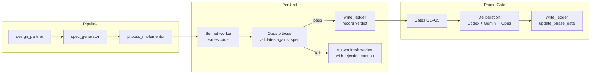
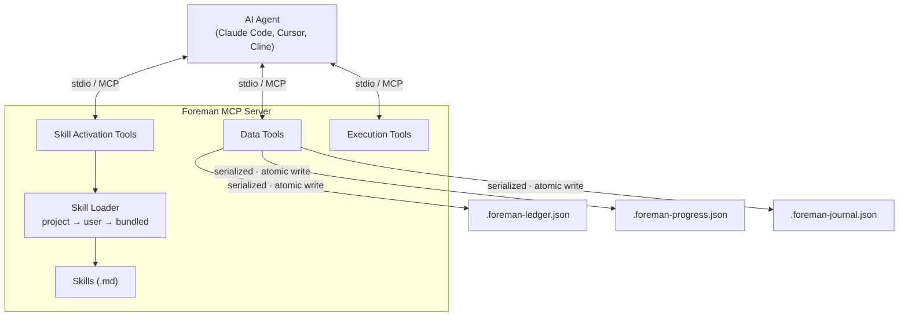

<p align="center">
  
</p>

<p align="center">
  <a href="https://github.com/malindarathnayake/foreman/actions/workflows/build.yml"></a>
  <a href="LICENSE"></a>
  <a href="https://nodejs.org/"></a>
</p>

**A software development governance layer for AI coding agents.** Foreman enforces a design → spec → implement pipeline, validates every state change through a structured ledger, and uses independent models (Codex, Gemini) to review work at phase gates. It doesn't write code — it supervises agents that do.

**15 tools. 3 skill protocols. ~750 tokens idle overhead.**

---

## Quick Start

### Install

```bash
curl -LO https://github.com/malindarathnayake/Foreman/raw/main/artifacts/malindarathnayake-foreman-mcp-0.0.7.tgz
npm install -g malindarathnayake-foreman-mcp-0.0.7.tgz
```

Or via GitHub Packages: `npm install -g @malindarathnayake/foreman-mcp` ([setup](https://docs.github.com/en/packages/working-with-a-github-packages-registry/working-with-the-npm-registry#authenticating-to-github-packages))

### Configure

Add to your MCP settings (`~/.claude/settings.json`, `.cursor/mcp.json`, or Cline config):

```json
{
  "mcpServers": {
    "foreman": {
      "command": "foreman-mcp"
    }
  }
}
```

<details>
<summary>Other install methods (npx, Windows)</summary>

Via npx (no install):
```json
{ "mcpServers": { "foreman": { "command": "npx", "args": ["-y", "@malindarathnayake/foreman-mcp"] } } }
```

Windows:
```json
{ "mcpServers": { "foreman": { "command": "cmd", "args": ["/c", "foreman-mcp"] } } }
```
</details>

---

## How It Works (In a Nutshell)

Foreman is an MCP server that injects structured workflow protocols into your AI coding agent. When you call a skill tool, Foreman returns a full set of instructions that the LLM follows — it doesn't need to figure out which tools to use or in what order.

The pipeline has three stages:

```
design_partner → spec_generator → pitboss_implementor
```

1. **Design** — You and the LLM workshop requirements interactively. The design partner pushes back on vague ideas, forces decisions on ambiguities, and uses Codex/Gemini for second opinions on non-trivial trade-offs. Output: `Docs/design-summary.md`.

2. **Spec** — The LLM transforms your design summary into four formal documents (spec, handoff, progress tracker, testing harness) and seeds the Foreman ledger with phase/unit structure. You review these by hand before proceeding.

3. **Implement** — The pitboss (Opus) reads the spec, builds a brief for each unit, spawns a disposable Sonnet worker, validates the output against the spec, runs self-review gates G1-G5, and records the verdict in the ledger. Failed workers are killed and replaced. At phase boundaries, independent models (Codex + Gemini) review the full phase before the gate can pass.

**The pitboss never writes code.** It reads, validates, and records. Workers write code but never see the full spec, the ledger, or prior units. This separation prevents hallucination accumulation and self-review bias.



---

## Usage Guide — Building a CLI Expense Tracker

This walkthrough shows the full Foreman pipeline using a real project: a Node.js CLI expense tracker with 4 commands (`add`, `list`, `summary`, `export`), JSON persistence, and zero runtime dependencies. This is the same app used in Foreman's AB test suite.

### Prerequisites

- Claude Code (or any MCP-compatible agent running Opus)
- Foreman MCP installed and configured (see Quick Start)
- A new project directory:
  ```bash
  mkdir expense-tracker && cd expense-tracker
  npm init -y
  npm install -D typescript vitest @types/node
  ```

### Stage 1: Design

Open Claude Code in your project directory and call the design partner:

```
> Call the foreman design_partner tool. I want to build a CLI expense tracker.
```

Foreman returns the design partner protocol. The LLM will:
- Ask scoping questions ("What commands?", "How do you store data?", "What's out of scope?")
- Push back on vague requirements ("You said 'handle errors appropriately' — what does that mean for a corrupt data file?")
- Use YIELD directives to pause and wait for your answers
- Escalate non-trivial ambiguities to Codex/Gemini deliberation

You work through the design interactively until all decisions are made. The output is a `Docs/design-summary.md` that captures:
- Problem statement
- Architecture and file structure
- Key decisions table (money storage, date format, error handling, etc.)
- Scope boundaries (in/out)
- Testing archetype

**This is the most important stage.** A good design summary produces a good spec. A vague one produces a spec full of gaps.

### Stage 2: Spec

Once your design summary is complete:

```
> Call the foreman spec_generator tool.
  Context: Design summary at Docs/design-summary.md
```

The spec generator reads your design summary and produces four documents:

| Document | Purpose |
|----------|---------|
| `Docs/spec.md` | Full implementation spec — architecture, behavior, error handling, testing strategy, implementation order with phases and units |
| `Docs/handoff.md` | Implementation instructions — what to do first, checkpoints, pitfalls |
| `Docs/PROGRESS.md` | Progress tracker — checklist, session log, error recovery |
| `Docs/testing-harness.md` | Test strategy — archetypes, mock boundaries, tier structure |

It also seeds the Foreman ledger with your phase/unit structure:

```
Phase 1: Foundation (types, validation, storage)
Phase 2: Commands (add, list, summary, export)
Phase 3: CLI Entry + Integration
```

**Stop here and review.** Read `spec.md` carefully. This is the contract the pitboss will enforce. If the spec says "round to 2 decimal places using `Math.round(amount * 100) / 100`" — that's exactly what the worker will implement and the pitboss will validate. Fix any issues in the spec before proceeding.

### Stage 3: Implement

Once the spec is right:

```
> Call the foreman pitboss_implementor tool.
  Context: Spec at Docs/spec.md, handoff at Docs/handoff.md. Start from Phase 1.
```

The pitboss takes over. For each unit it:

1. **Reads the unit spec** from handoff.md
2. **Reads existing source files** to build context
3. **Builds a worker brief** — only the information this worker needs, not the full spec
4. **Spawns a Sonnet worker** via the Agent tool
5. **Validates independently** — reads every modified file, re-runs tests, checks against spec
6. **Records the verdict** in the ledger via `write_ledger`

You watch the pitboss work. For the expense tracker, it spawns 7 workers across 3 phases:

```
Phase 1: types.ts + validate.ts → storage.ts                    (2 workers)
Phase 2: add.ts → list.ts → summary.ts → format.ts + export.ts  (4 workers)
Phase 3: main.ts + bin/expense.ts + cli.test.ts                  (1 worker)
```

At each phase boundary, the pitboss runs the full test suite and (if Codex/Gemini are installed) sends the phase changes for independent review before flipping the phase gate.

### What You Get

After the pipeline completes:

```
expense-tracker/
  bin/expense.ts           # CLI entry point
  src/
    main.ts                # Arg parser + command dispatch
    types.ts               # Expense interface, path constants
    validate.ts            # Amount, date, month validation
    storage.ts             # JSON file read/write/backup
    format.ts              # CSV/JSON formatters
    commands/
      add.ts, list.ts, summary.ts, export.ts
  tests/
    validate.test.ts, storage.test.ts, add.test.ts,
    list.test.ts, summary.test.ts, export.test.ts, cli.test.ts
  Docs/
    design-summary.md, spec.md, handoff.md, PROGRESS.md, testing-harness.md
    .foreman-ledger.json   # Full audit trail
    .foreman-progress.json # Progress state
```

**7 test files. 66-80 tests (worker variance). 100% pass rate. Zero runtime dependencies.**

The ledger records every status change, delegation, verdict, and phase gate — a complete audit trail of how the code was built.

---

## Security Posture

Foreman v0.0.7 was hardened through a Purple Team pentest pipeline 

### Threat Model

Foreman is a **stdio-only MCP server**. The trust boundary is the parent process (Claude Code) — any process that can spawn `foreman-mcp` already has equivalent user-level access. There is no network exposure, no HTTP listener, and no auth/authz layer (by design — stdio pipes don't need them).

### Defense Layers

| Layer | What It Protects | How |
|-------|-----------------|-----|
| **Input validation** | All 15 MCP tools | Zod schemas with `.max()` length caps, enum restrictions, regex filters on every input |
| **Runner allowlist** | `run_tests` tool | Only `npm`, `pytest`, `go`, `cargo`, `dotnet`, `make`. Regex filter (`/^[a-zA-Z0-9_.-]+$/`) on env-supplied entries. `npx` explicitly denied |
| **Absolute path resolution** | CLI invocation | All external CLIs resolved to absolute paths via `which`/`where`. Relative paths and `.cmd`/`.bat` shims rejected on Windows |
| **Stdin delivery** | `invoke_advisor` tool | Prompts sent via stdin pipe, not command-line args. Bypasses shell metacharacter injection and OS `ARG_MAX` limits |
| **Buffer caps** | External CLI output | Hard caps on stdout/stderr (16KB default, 4x multiplier for `run_tests`). Settled guards prevent buffer growth after cap fires |
| **FIFO caps** | Internal state growth | Rejection arrays capped at 20, journal events at 200/session, sessions at 50, error logs at 20 |
| **Atomic writes** | Ledger/progress/journal | Write to `.tmp` file first, then `rename()`. No partial corruption on crash |
| **Block format output** | Advisor result parsing | Metadata separated from raw stdout/stderr blocks. Prevents TOON injection from advisory CLI output |
| **ComSpec hardening** | Windows `.cmd` wrapper | `cmd.exe` resolved via `SystemRoot` (OS-set at boot), not user-controllable `ComSpec` env var |

### Accepted Residuals

| Risk | Why Accepted |
|------|-------------|
| `npm exec` can run arbitrary packages | Restricting npm subcommands requires arg parsing — different scope. `npm` is the primary CI use case |
| No auth on MCP tools | Stdio-only, same-user privilege. ZTNA + EDR covers the threat model |
| No RBAC / tool scoping | Single-user dev tool. All tools available to parent process by design |
| Grandchild process orphans | `SIGTERM`/`SIGKILL` hits direct child only. Needs `detached: true` + process group kill (v0.0.8) |

### Pentest History

| Version | Findings | Fixed | Accepted | Deferred |
|---------|:--------:|:-----:|:--------:|:--------:|
| v0.0.5 | 8 | 5 | 3 | 0 |
| v0.0.6 | 6 | 5 | 0 | 1 |
| **Total** | **14** | **10** | **3** | **1** |

### Dependencies

**2 production dependencies:** `@modelcontextprotocol/sdk`, `zod`. No heavy frameworks, no transitive risk surface beyond the MCP SDK.

---

## Why This Exists

AI coding agents are good at writing code but bad at governance. On multi-file projects they lose context across sessions, skip design, self-review their own work, and leave no audit trail. Skills alone can't fix this — a skill can say "update the ledger after each unit" but the agent can forget or hallucinate the update.

Foreman separates the concerns:
- **Skills** provide the workflow (design → spec → implement → gate)
- **MCP tools** provide the infrastructure (validated writes, bounded reads, mutex serialization, enum schemas)
- **The ledger** provides the audit trail (survives crashes, sessions, and context resets)

One `npm install` gives any MCP-compatible agent the full pipeline.

The AI coding landscape in 2026 has matured

Cursor has Plan Mode, Codex CLI has session persistence, Devin can orchestrate child agents. 
ut none enforce a design-before-code pipeline with cross-model deliberation and a structured audit ledger.

| | Foreman | Cursor 3 | Codex CLI | Devin |
|---|---------|----------|-----------|-------|
| **Design before code** | Enforced | Optional (Plan Mode) | No | Needs upfront spec |
| **Independent review** | Codex + Gemini (different models) | BugBot (same model, 8 passes) | Same model | Same agent |
| **Structured ledger** | Verdicts, rejections, phase gates | Enterprise audit logs | SQLite session threads | Session logs |
| **Writer/reviewer split** | Opus validates, Sonnet writes | Same agent | Same agent | Same agent |
| **Multi-model deliberation** | Per phase completion (optional, skippable) | `/best-of-n` (no gates) | No | Same model |

---

## Tools Reference

### Skill Activation (3 tools)

| Tool | Protocol injected |
|------|-------------------|
| `design_partner` | Collaborative design session with YIELD checkpoints |
| `spec_generator` | Spec generation + ledger/progress seeding |
| `pitboss_implementor` | Pitboss/worker orchestration with G1-G5 gates |

### Data (8 tools)

| Tool | Purpose |
|------|---------|
| `read_ledger` / `write_ledger` | Unit status, verdicts, rejections, phase gates |
| `read_progress` / `write_progress` | Bounded progress view, phase management |
| `read_journal` / `write_journal` | Session telemetry — friction events, rollups |
| `bundle_status` | Server version and override info |
| `changelog` | Version history |

### Execution (4 tools)

| Tool | Purpose |
|------|---------|
| `capability_check` | Detect if Codex/Gemini CLI is installed and authenticated |
| `invoke_advisor` | Run Codex or Gemini CLI with stdin prompt delivery |
| `run_tests` | Bounded test execution with runner allowlist (`npm`, `pytest`, `go`, `cargo`, `dotnet`, `make`) |
| `normalize_review` | Parse review findings into structured format |

---

## Architecture



**Stack:** TypeScript (ESM) · `@modelcontextprotocol/sdk` · Zod · stdio transport · 2 prod deps

### Skill overrides

When a skill tool is called, the loader checks for local overrides first:

```
.claude/skills/<skill-name>/SKILL.md        # project-local (highest priority)
~/.claude/skills/<skill-name>/SKILL.md      # user-global
<bundled>/skills/<skill-name>.md            # packaged default
```

---

## FAQ

**Isn't the pitboss just an LLM grading another LLM's homework?**

No. The pitboss re-runs the test command itself and reads stdout/stderr — it does not trust the worker's self-report (`implementor.md`, step 6). A unit cannot pass unless the tests actually execute and exit clean. On top of that, five named gates (G1–G5) check contract completeness, assertion integrity, spec fidelity, test-suite impact, and worker hygiene — several via deterministic grep/pattern matching, not LLM judgment. At phase boundaries the full test suite runs again before the phase gate can flip to `pass`. The LLM review layer handles *semantic* validation (does the code implement what the spec describes?) which static analysis and tests cannot cover.

**Doesn't a flat JSON ledger fall over with parallel workers?**

The architecture is single-writer by design. Workers never touch the ledger — only the pitboss writes verdicts after validating each unit. Writes are serialized via a per-path promise-chain lock and use atomic `.tmp`→`rename` to prevent partial corruption. There is no fan-out write contention because the pitboss dispatches units sequentially: dispatch → worker executes → pitboss validates → write ledger → next unit.

**Multi-model deliberation at every gate must be incredibly slow and expensive.**

Deliberation runs once per *phase completion*, not per unit. A 3-phase project triggers ~3 deliberation sessions total. It is also conditional: if Codex/Gemini CLIs aren't installed, the pitboss asks the user whether to proceed without them. Users can skip deliberation entirely with "skip council." The ~750 token idle overhead is the MCP server's baseline; active deliberation cost scales with the number of phases, not units.

**Why not replace the Opus validation entirely with CI/CD?**

Tests and linters answer "does it compile and pass assertions." They cannot answer "did you implement the requirement the spec describes" or "does this integration break the contract from a prior unit." Semantic validation — checking that code *means* what the spec *says* — is the gap the LLM review fills. Foreman layers both: deterministic gates first (tests, pattern matching), then LLM review for what automation can't catch.

**What happens if the context window resets mid-implementation?**

The ledger and progress files survive on disk. A new session reads them back and resumes from the last recorded state. Completed units keep their verdicts; in-progress units restart with the rejection history intact.

---

## Development

```bash
git clone https://github.com/malindarathnayake/foreman.git
cd foreman/foreman-mcp
npm install
npm run build
npm test          # 146 tests across 10 files
```

---

## License

[AGPL-3.0](LICENSE) — Copyright (c) 2026 Malinda Rathnayake
