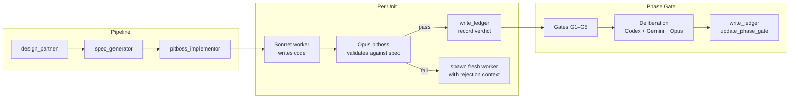
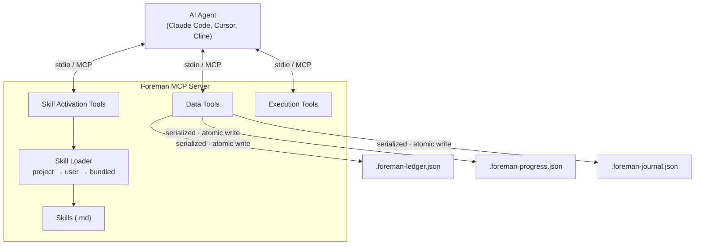

<p align="center">
  
</p>

<p align="center">
  <a href="https://github.com/malindarathnayake/foreman/actions/workflows/build.yml"></a>
  <a href="LICENSE"></a>
  <a href="https://nodejs.org/"></a>
</p>

**A software development governance layer for AI coding agents.** Foreman enforces a design → spec → implement pipeline, validates every state change through a structured ledger, and uses independent models (Codex, Gemini, GPT-5.5, Gemini-3.1-pro) to review work at phase gates. It doesn't write code — it supervises agents that do.

**17 tools. 3 skill protocols. Multi-host: Claude Code, Cursor, Codex CLI.** v0.0.8 adds host-aware skill rendering — same protocol, host-specific worker/advisor invocation.

---

## Quick Start

### Install — GitHub Packages (recommended)

Foreman is published to GitHub Packages. Add a `.npmrc` in your project (or home directory) so the scope resolves to GitHub:

```
@malindarathnayake:registry=https://npm.pkg.github.com
```

Then install globally:

```bash
npm install -g @malindarathnayake/foreman-mcp
```

GitHub Packages requires a personal access token with `read:packages` scope, even for public packages — set `NPM_TOKEN` or run `npm login --registry=https://npm.pkg.github.com` once.

### Install — tarball (no auth required)

```bash
curl -LO https://github.com/malindarathnayake/Foreman/releases/download/v0.0.9/malindarathnayake-foreman-mcp-0.0.9.tgz
npm install -g malindarathnayake-foreman-mcp-0.0.9.tgz
```

Or grab the latest tarball directly from the [Releases page](https://github.com/malindarathnayake/Foreman/releases/latest). The repo's `artifacts/` folder retains historical tarballs (≤ v0.0.8) for archival reference; new versions live only on Releases + GitHub Packages.

### Configure

Add to your MCP settings (`~/.claude/settings.json`, `.cursor/mcp.json`, or Cline config).

**Claude Code (default):**

```json
{
  "mcpServers": {
    "foreman": {
      "command": "foreman-mcp"
    }
  }
}
```

**Cursor (uses Task subagents instead of CLIs):**

```json
{
  "mcpServers": {
    "foreman": {
      "command": "foreman-mcp",
      "args": ["--host=cursor"]
    }
  }
}
```

In `cursor` mode, workers spawn via the Cursor `Task` tool with `claude-4.6-sonnet-medium-thinking`, and advisors run as `gpt-5.5-medium` + `gemini-3.1-pro` (with `composer-2-fast` fallback) — no external CLI binaries required. Confirm with `mcp__foreman__host_status` after connecting.

<details>
<summary>Host resolution precedence</summary>

1. `--host=<id>` CLI flag (recommended — visible in MCP config)
2. `FOREMAN_HOST` env var (must be nested under `env` in MCP config)
3. Default: `claude-code`

Accepted values: `claude-code`, `cursor`, `codex` (codex is currently an alias of claude-code). Unknown values fall back to claude-code with a stderr warning.
</details>

<details>
<summary>Windows install note</summary>

```json
{ "mcpServers": { "foreman": { "command": "cmd", "args": ["/c", "foreman-mcp"] } } }
```
</details>

---

## How It Works

```
design_partner → spec_generator → pitboss_implementor
```

1. **Design** — You and the LLM workshop requirements interactively. Output: `Docs/design-summary.md`.
2. **Spec** — Transforms the design into four formal documents (spec, handoff, progress tracker, testing harness) and seeds the ledger.
3. **Implement** — The pitboss builds a brief per unit, spawns a disposable Sonnet worker (Claude Code: `Agent` tool with sonnet · Cursor: `Task` tool with claude-4.6-sonnet-medium-thinking), validates output against the spec, runs gates G1–G5, records the verdict. At phase boundaries, two advisors review independently (Claude Code: Codex + Gemini CLIs · Cursor: GPT-5.5 + Gemini-3.1-pro subagents).

**The pitboss never writes code.** Workers write code but never see the full spec, the ledger, or prior units. This separation prevents hallucination accumulation and self-review bias.



> **Full walkthrough:** [Usage Guide — Building a CLI Expense Tracker](usage-guide.md)

---

## Tools Reference

### Skill Activation (3 tools)

| Tool | Protocol injected |
|------|-------------------|
| `design_partner` | Collaborative design session with YIELD checkpoints |
| `spec_generator` | Spec generation + ledger/progress seeding |
| `pitboss_implementor` | Pitboss/worker orchestration with G1-G5 gates |

### Data (10 tools)

| Tool | Purpose |
|------|---------|
| `read_ledger` / `write_ledger` | Unit status, verdicts (with `via` attribution), rejections, phase gates, phase scope |
| `read_progress` / `write_progress` | Bounded progress view, phase management, fenced PROGRESS.md auto-sync |
| `read_journal` / `write_journal` | Session telemetry — friction events, rollups |
| `session_orient` | Returns current phase, last completed, and next-up unit in one call |
| `bundle_status` | Server version and override info |
| `host_status` | Active host (claude-code/cursor/codex) + worker/advisor model slugs |
| `changelog` | Version history |

### Execution (4 tools)

| Tool | Purpose |
|------|---------|
| `capability_check` | Detect if Codex/Gemini CLI is installed and authenticated. In `cursor` host mode, returns synthetic-available (Task subagent is always reachable) |
| `invoke_advisor` | Run Codex or Gemini CLI with stdin prompt delivery (claude-code/codex hosts) |
| `run_tests` | Bounded test execution with runner allowlist (`npm`, `pytest`, `go`, `cargo`, `dotnet`, `make`) |
| `normalize_review` | Parse review findings into structured format |

---

## Architecture



**Stack:** TypeScript (ESM) · `@modelcontextprotocol/sdk` · Zod · stdio transport · 2 prod deps

### Skill overrides

```
.claude/skills/<skill-name>/SKILL.md        # project-local (highest priority)
~/.claude/skills/<skill-name>/SKILL.md      # user-global
<bundled>/skills/<skill-name>.md            # packaged default
```

---

## Security Posture

Foreman v0.0.7 was hardened through a Purple Team pentest pipeline.

### Threat Model

Foreman is a **stdio-only MCP server**. The trust boundary is the parent process (Claude Code) — any process that can spawn `foreman-mcp` already has equivalent user-level access. No network exposure, no HTTP listener, no auth layer (by design — stdio pipes don't need them).

### Defense Layers

| Layer | What It Protects | How |
|-------|-----------------|-----|
| **Input validation** | All 17 MCP tools | Zod schemas with `.max()` length caps, enum restrictions, regex filters on every input |
| **Runner allowlist** | `run_tests` tool | Only `npm`, `pytest`, `go`, `cargo`, `dotnet`, `make`. Regex filter (`/^[a-zA-Z0-9_.-]+$/`) on env-supplied entries. `npx` explicitly denied |
| **Absolute path resolution** | CLI invocation | All external CLIs resolved to absolute paths via `which`/`where`. Relative paths and `.cmd`/`.bat` shims rejected on Windows |
| **Stdin delivery** | `invoke_advisor` tool | Prompts sent via stdin pipe, not command-line args. Bypasses shell metacharacter injection and OS `ARG_MAX` limits |
| **Buffer caps** | External CLI output | Hard caps on stdout/stderr (16KB default, 4x multiplier for `run_tests`). Settled guards prevent buffer growth after cap fires |
| **FIFO caps** | Internal state growth | Rejection arrays capped at 20, journal events at 200/session, sessions at 50, error logs at 20 |
| **Atomic writes** | Ledger/progress/journal | Write to `.tmp` file first, then `rename()`. No partial corruption on crash |
| **Block format output** | Advisor result parsing | Metadata separated from raw stdout/stderr blocks. Prevents TOON injection from advisory CLI output |
| **ComSpec hardening** | Windows `.cmd` wrapper | `cmd.exe` resolved via `SystemRoot` (OS-set at boot), not user-controllable `ComSpec` env var |

### Accepted Residuals

| Risk | Why Accepted |
|------|-------------|
| `npm exec` can run arbitrary packages | Restricting npm subcommands requires arg parsing — different scope. `npm` is the primary CI use case |
| No auth on MCP tools | Stdio-only, same-user privilege. ZTNA + EDR covers the threat model |
| No RBAC / tool scoping | Single-user dev tool. All tools available to parent process by design |
| Grandchild process orphans | `SIGTERM`/`SIGKILL` hits direct child only. Needs `detached: true` + process group kill (deferred to v0.0.9) |

### Pentest History

| Version | Findings | Fixed | Accepted | Deferred |
|---------|:--------:|:-----:|:--------:|:--------:|
| v0.0.5 | 8 | 5 | 3 | 0 |
| v0.0.6 | 6 | 5 | 0 | 1 |
| **Total** | **14** | **10** | **3** | **1** |

v0.0.7.5 was a workflow-hygiene patch — skill trim, ledger honesty, session orient. v0.0.8 adds host-aware skill rendering (Cursor mode) — purely additive; no new attack surface (no new external IO, no new shell invocation paths). All existing defenses intact.

### Dependencies

**2 production dependencies:** `@modelcontextprotocol/sdk`, `zod`. No heavy frameworks, no transitive risk surface beyond the MCP SDK.

---

## What's New in v0.0.8

| Change | Detail |
|--------|--------|
| Cursor host mode | `--host=cursor` (or `FOREMAN_HOST=cursor`) renders skills with Cursor `Task` subagent invocation: `claude-4.6-sonnet-medium-thinking` for workers, `gpt-5.5-medium` + `gemini-3.1-pro` for advisors (`composer-2-fast` fallback) |
| `host_status` tool | Read-only introspection of active host + model slugs |
| Host-aware `capability_check` | Synthetic-available in cursor mode (no shelling out for Task subagents) |
| Single source of truth | Skill protocols use placeholders (`{{worker_invoke}}`, `{{advisor_a}}`, `{{advisor_b}}`); same gates, host-specific invocation |
| Default unchanged | Claude Code / Codex CLI users see byte-identical skill rendering — zero migration |
| Distribution | GitHub Packages npm registry (`@malindarathnayake/foreman-mcp`) added alongside existing tarball releases |

---

## FAQ

**Isn't the pitboss just an LLM grading another LLM's homework?**
No. The pitboss re-runs tests itself and reads stdout/stderr — it doesn't trust the worker's self-report. Five named gates (G1–G5) check contract completeness, assertion integrity, spec fidelity, test-suite impact, and worker hygiene — several via deterministic pattern matching. The LLM layer handles *semantic* validation that static analysis can't cover.

**Doesn't a flat JSON ledger fall over with parallel workers?**
Single-writer by design. Only the pitboss writes; units dispatch sequentially. Writes are serialized via a per-path promise-chain lock with atomic `.tmp`→`rename`.

**Multi-model deliberation must be slow and expensive.**
It runs once per *phase completion*, not per unit. A 3-phase project triggers ~3 sessions. Skippable if Codex/Gemini aren't installed or via "skip council."

**Why not replace Opus validation with CI/CD?**
Tests answer "does it compile and pass assertions." They can't answer "did you implement what the spec describes." Foreman layers both: deterministic gates first, then LLM review for what automation can't catch.

**What if the context window resets mid-implementation?**
The ledger and progress files survive on disk. A new session reads them back and resumes from the last recorded state.

---

## Development

```bash
git clone https://github.com/malindarathnayake/foreman.git
cd foreman/foreman-mcp
npm install
npm run build
npm test          # 343 tests across 17 files
```

---

## License

[AGPL-3.0](LICENSE) — Copyright (c) 2026 Malinda Rathnayake
