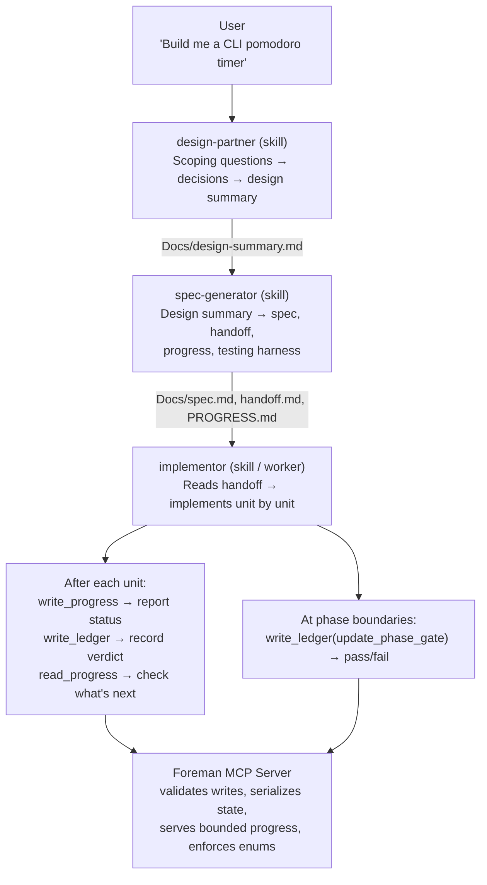
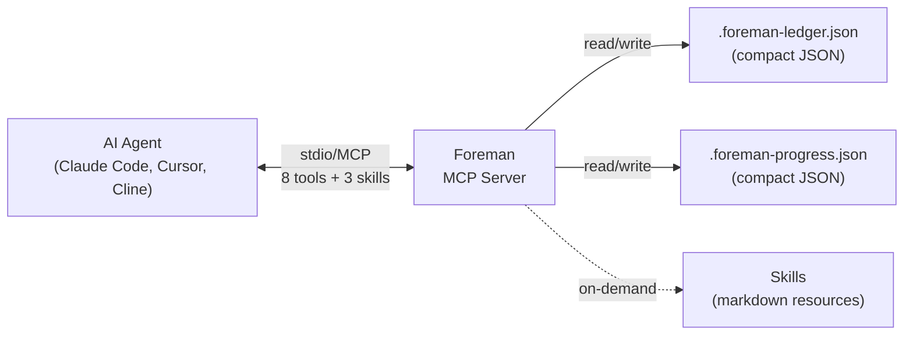

<p align="center">
  
</p>

<p align="center">
  <a href="https://github.com/malindarathnayake/foreman/actions/workflows/build.yml"></a>
  <a href="LICENSE"></a>
  <a href="https://nodejs.org/"></a>
</p>

**An MCP server that adds structured progress tracking, phase gates, and implementation audit trails to AI coding agents.**

---

## Why This Exists

AI coding agents (Claude Code, Cursor, Cline) are good at writing code but bad at staying on track. On multi-file, multi-phase projects they lose context across sessions, skip steps, may lose state after crashes, and leave no structured audit trail at the project level.

### Why not just a skill?

Skills are markdown prompts — they tell the agent *what to do* but can't enforce *that it does it*. A skill can say "update PROGRESS.md after each unit" but the agent can forget, hallucinate the update, or silently skip it. There's no validation layer.

### Why an MCP server?

| Capability | Skill alone | Foreman MCP |
|-----------|------------|-------------|
| **Atomic writes** | Agent does `Edit` on a JSON file — if two subagents write concurrently, last write wins, state lost | In-process mutex serializes all writes. No corruption. |
| **Schema validation** | Agent writes freeform text — typos in status fields silently pass | Enum-typed operations. `"staus"` is rejected at the tool level, not discovered 3 phases later. |
| **Bounded context** | Agent reads full PROGRESS.md — grows unboundedly, wastes tokens | `read_progress` returns truncated view (~400 tokens). Agent sees what it needs, not everything. |
| **Cross-session state** | Agent must re-read and re-parse files each session | Ledger and progress are structured JSON — tools query specific units, phases, or gates without parsing. |
| **Portable across agents** | Skill is Claude Code-specific markdown | MCP works with Claude Code, Cursor, Cline, or any MCP client. Same tools, same state format. |

The skills provide the *workflow* (design → spec → implement → gate). The MCP server provides the *infrastructure* that makes the workflow reliable — validated writes, bounded reads, concurrent safety, and agent portability.

### How it works: the Pitboss architecture

Foreman follows a **pitboss/worker** model — the Foreman doesn't write code, it supervises agents that do.



The **skills are the workers** — they do the thinking and the coding. The **MCP server is the foreman** — it holds the ledger, validates every status update, and ensures the workers can't corrupt shared state. Workers report to Foreman after every unit. Foreman never writes code.

This is all possible with skills alone — and we tested that (the "native arm" in our AB test produced 35 tests vs MCP's 54). But MCP made sense as the distribution format: one `npx` command gives any MCP-compatible agent the full workflow with validated state tracking, instead of copying markdown files between projects.

**~750 tokens idle overhead. 8 tools. 3 skills loaded on-demand.**

---

## Quick Start

### 1. Configure your agent

Add Foreman to your MCP settings:

<details>
<summary><strong>Claude Code</strong> (~/.claude/settings.json)</summary>

```json
{
  "mcpServers": {
    "foreman": {
      "command": "npx",
      "args": ["-y", "@malindarathnayake/foreman-mcp"]
    }
  }
}
```
</details>

<details>
<summary><strong>Cursor</strong> (.cursor/mcp.json)</summary>

```json
{
  "mcpServers": {
    "foreman": {
      "command": "npx",
      "args": ["-y", "@malindarathnayake/foreman-mcp"]
    }
  }
}
```
</details>

<details>
<summary><strong>Cline</strong> (MCP settings)</summary>

```json
{
  "mcpServers": {
    "foreman": {
      "command": "npx",
      "args": ["-y", "@malindarathnayake/foreman-mcp"]
    }
  }
}
```
</details>

### 2. Use

```
> run the foreman:design-partner skill     # Interactive design session
> invoke foreman:spec-generator            # Generate implementation docs
> invoke foreman:implementor               # Execute the plan unit-by-unit
```

That's it. Foreman tracks progress, enforces phase gates, and logs everything to a compact ledger — across sessions, across crashes.

---

## What It Does

### Skills (loaded on-demand as MCP resources)

| Skill | Purpose |
|-------|---------|
| `design-partner` | Interactive design sessions with scoping questions, push-back, and YIELD directives that force the agent to stop and wait for user input |
| `spec-generator` | Transforms a design summary into 4 implementation documents (spec, handoff, progress, testing harness) |
| `implementor` | Executes the plan unit-by-unit with self-review gates at each phase checkpoint |

### Tools (8 total, enum-typed operations)

| Tool | Purpose |
|------|---------|
| `bundle_status` | Server version and override info |
| `changelog` | Version history |
| `read_ledger` | Query unit status, verdicts, rejections, phase gates |
| `write_ledger` | Record unit status, verdicts, rejections, gate results |
| `read_progress` | Bounded progress view (truncated to last N completed + all incomplete) |
| `write_progress` | Start phases, update status, complete units, log errors |
| `capability_check` | Verify external CLI tools are available |
| `normalize_review` | Structure code review findings for remediation planning |

---

## Architecture



**Stack:** TypeScript (ESM) · `@modelcontextprotocol/sdk` · Zod
**Transport:** stdio (MCP standard)
**State:** Local JSON files in the project directory

Foreman is designed to minimize context window cost — compact single-line JSON with short keys, TOON (plain-text) tool responses, bounded progress truncation, and on-demand skill loading.

---

## Skill Overrides

To customize any skill, create a local override:

```
~/.claude/skills/<skill-name>/SKILL.md      # user-global
.claude/skills/<skill-name>/SKILL.md        # project-local
```

Local skills always take precedence over MCP-delivered skills.

---

## Development

```bash
git clone https://github.com/malindarathnayake/foreman.git
cd foreman/foreman-mcp
npm install
npm run build
npm test          # 86 tests across 7 files
```

---

## License

[AGPL-3.0](LICENSE) — Copyright (c) 2026 Malinda Rathnayake
