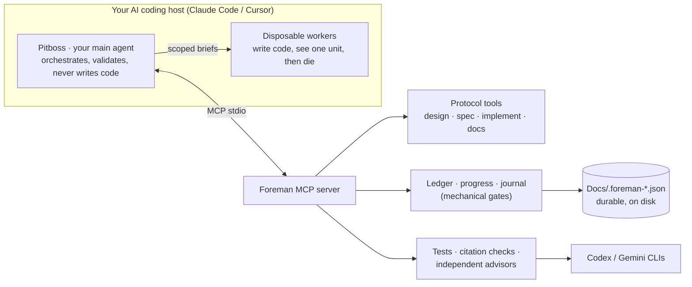

<p align="center">
  
</p>

<p align="center">
  <a href="https://github.com/malindarathnayake/Foreman/actions/workflows/build.yml"></a>
  <a href="LICENSE"></a>
  <a href="https://nodejs.org/">= 22" /></a>
</p>

# Foreman

**The model can be wrong. The ledger doesn't have to be agreeable.**

Foreman is an MCP server that makes AI coding agents keep receipts. Your agent still reasons, plans, and writes code — but "done" stops being something the model *says* in chat and becomes a recorded, gated claim on disk. Like the person it's named after: a foreman doesn't lay bricks. He decides what counts as finished, keeps the record, and doesn't take anyone's word for it.

**Current release:** `v0.5.0` · **Package:** `@malindarathnayake/foreman-mcp` · **Runtime:** Node.js `>=22` · **License:** Apache-2.0

---

## The problem

You hand an agent a multi-phase implementation on Friday. Tuesday you open a fresh session and ask what's done. It answers — confidently, plausibly, and from a context window that has since been compacted, summarized, or invented. Long agent coding runs fail in boring, repeatable ways:

- the plan drifts, and nobody notices until a worker builds on a file that doesn't exist
- the same agent that wrote the bad code reviews the bad code, and defends it
- "all tests pass" is a claim in a chat log, not an observation
- one oversized tool dump — a `curl` that returns 50 KB of JSON — floods the window; ten minutes later the model has forgotten its own edits, and compaction quietly buries the decision that mattered
- the next session reconstructs status from conversation summaries — the least reliable source in the whole system

Every one of these is a *trust* failure, not an intelligence failure. Smarter models make the claims more convincing, not more true. And none of it is a big-project problem — it is a **context** problem. A frontier model with a polluted window can perform worse than a small model with a clean one, and the pollution arrives silently in any session that runs long enough. That is the boring physics Foreman is built around: the window degrades; the record must not.

## What Foreman does about it

Foreman moves process state out of the chat and into files and gates that don't take the model's word for anything. This is real tool output (tails trimmed at `[…]`):

```text
> write_ledger { operation: "set_verdict", phase: "P2", unit_id: "U3", data: { v: "pass" } }
Error: VERDICT BLOCKED: Cannot set verdict 'pass' without prior delegation. Unit must go
through: set_unit_status(s:'ip') → set_unit_status(s:'delegated', brief:'...') →
set_verdict(v:'pass'). […]

> write_ledger { operation: "update_phase_gate", phase: "P2", data: { g: "pass" } }
Error: PHASE GATE BLOCKED: phase 'P2' has units without a pass verdict: U5. Every unit
must reach set_verdict(v:'pass') before the phase gate can pass.

> write_ledger { operation: "set_verdict", phase: "P4", unit_id: "U7", data: { v: "pass" } }
Error: ATTESTATION REQUIRED: phase 'P4' declares scope has_tests:false. set_verdict(v:'pass')
must include a non-empty 'note' describing how the unit was validated in place of automated
tests/build (e.g. manual smoke, artifact hash, console inspection). […]
```

These refusals are enforced in TypeScript, not in prompt text. The rules don't get compacted out of context and don't soften when the model argues.

**The honest boundary:** the gates enforce the evidence chain, not omniscience. A determined agent could still fabricate a worker brief and record a delegation that never happened — what it *cannot* do is reach a passing phase without leaving a complete, timestamped, reviewable record of every claim along the way. That changes the failure mode: models bluff freely in ephemeral chat, where claims evaporate; forging a durable ledger entry is a different act, and the record is exactly what catches it on review. The mechanism enforces ordering; honesty is left with the much smaller job of not committing fraud in writing.

And the record is still there — what passed, what failed, what was tried — when you resume three days later:

```text
> session_orient
status: in_progress
current_phase: P3
last_completed_unit: U9
next_pending_unit: U11
blocked_on: null
active_rejections: 1
```

That's the product. Everything else is in service of it.

## How it works


```mermaid
flowchart LR
    subgraph Host["Your AI coding host (Claude Code / Cursor)"]
        Pitboss["Pitboss · your main agent<br/>orchestrates, validates, never writes code"]
        Workers["Disposable workers<br/>write code, see one unit, then die"]
        Pitboss -->|"scoped briefs"| Workers
    end

    Pitboss <-->|"MCP stdio"| Foreman["Foreman MCP server"]

    Foreman --> Protocols["Protocol tools<br/>design · spec · implement · docs"]
    Foreman --> State["Ledger · progress · journal<br/>(mechanical gates)"]
    Foreman --> Review["Tests · citation checks ·<br/>independent advisors"]

    State --> Files[("Docs/.foreman-*.json<br/>durable, on disk")]
    Review --> CLIs["Codex / Gemini CLIs"]
```

Five ideas, working together:

1. **Protocols are injected, not installed.** Calling `design_partner`, `spec_generator`, or `pitboss_implementor` hands your agent a complete operating procedure — how to scope, delegate, validate, and record. The procedures are markdown you can override per-project or per-user.
2. **Orchestration and implementation are different jobs.** The *pitboss* — Foreman's name for your main agent, the one running the floor — reads specs, writes minimal briefs, checks results, and owns the ledger. *Workers* are disposable host-native subagents that see one unit's files and nothing else — so a worker that went down a bad path never gets to defend it, and the orchestrator's context stays clean of diffs and failed attempts.
3. **Claims are untrusted until grounded.** Workers don't self-certify. The pitboss re-reads changed files and reruns tests. Specs cite `file:line`, and `verify_citations` re-checks that those anchors still exist. Reviews from independent advisors (Codex, Gemini) are normalized into structured findings before they're allowed to create work.
4. **State lives on disk, in one authority.** `session_orient` resumes from the ledger — never from chat memory. The ledger is externalized memory: the chat window can fill, compact, or get wrecked by one oversized tool dump, and the record of what passed, what failed, and what was tried doesn't move. Recovery from a trashed context is `/clear` + `session_orient` — not archaeology. Corrupt state reports itself instead of pretending the project is fresh.
5. **Sessions end on purpose.** Phase checkpoints mandate a fresh session. Context degradation is invisible from inside the window, so the protocol forces the reset *before* the expensive mistakes instead of after — and the ledger makes resets free. A logic bug caught at the phase-2 gate costs one fix; the same bug excavated at phase 5, after three phases built on top of it, costs the archaeology plus the rework.

## Is Foreman for you?

**Use it when:** the work spans multiple phases or sessions; you need to hand a run to tomorrow-you (or a teammate) with evidence instead of a chat transcript; you're coordinating multiple models (frontier orchestrator, cheap workers, independent reviewers) and want the same gates applied to all of them; being able to *audit* what the agent did matters as much as the code; or the session will simply run long enough for context to rot — heavy tool output, many files read, a compaction or two — even when the "project" is a single feature. The dividing line is **context accumulation, not project size**: `lighttask` exists precisely so small surgical work still puts its grounding and its record on disk instead of betting them on the window.

### When to skip Foreman

The task fits in one sitting and one context window. A single-file fix, a prototype, a script — plan mode and a test run beat any process layer. Stated plainly, the worst cases:

- **Single-sitting tasks.** If you'll finish before the context ever needs to survive a break, the process overhead exceeds the value it returns.
- **Throwaway prototypes.** Nothing here is worth grounding if the code isn't going to outlive the week.
- **Work nobody will ever audit.** The entire value proposition is a reviewable trail. If no one — not you, not a teammate, not future-you — will ever read the ledger, you paid for a receipt nobody wants.
- **A pitboss seat filled by a very small model.** The protocol assumes a frontier-class orchestrator. Phases flagged `hot_path` or `security_boundary` mechanically require declaring a frontier-class agent seat before their gate can pass — a small model in that seat hits a wall the mechanism put there on purpose.

Foreman's overhead is real and not hidden: a 10–17 KB procedure injection per protocol activation, plus a tool call for every state write (same numbers as the token-cost FAQ answer below). It pays for itself on work that's big enough to drift and long enough to lie about — not below that line.

**What it is not:** Foreman doesn't write code (workers native to your host do). It doesn't pick models or route requests. It doesn't replace Claude Code, Cursor, your test suite, or CI — it's the control plane that makes their long-running output checkable. Foreman itself carries no telemetry — nothing about your usage leaves your machine — but it is not fully offline: the optional advisor workflow shells out to Codex/Gemini CLIs you installed, which send prompts to their own clouds (your choice, per invocation), and the EXPERIMENTAL `invoke_worker` tool sends briefs and file excerpts to the OpenAI-compatible endpoint you configure in `.foremanenv` — it does nothing until that file exists.

---

## The protocols

| Protocol | Use when | Output |
|---|---|---|
| `lighttask` | Small surgical work that still needs grounding and review | `Docs/lighttask.md` |
| `design_partner` | Requirements are unclear or architecture decisions matter | `Docs/design-summary.md` |
| `spec_generator` | A design summary is approved and needs implementation docs | `Docs/spec.md`, `Docs/handoff.md`, `Docs/PROGRESS.md`, `Docs/testing-harness.md` |
| `pitboss_implementor` | Multi-unit implementation from prepared specs | Ledger-backed implementation run |
| `spec_man` | You need intended-behavior specs for an existing repo or plan | Human spec + machine spec |
| `doc_man` | You need grounded technical docs from specs, code, or discovery | README, architecture, data-flow, Confluence, or machine docs |

```text
small clear change       → lighttask
unclear behavior         → spec_man
new feature design       → design_partner → spec_generator
phased implementation    → pitboss_implementor
technical documentation  → doc_man
```

The full pipeline, end to end:

```text
1. design_partner       # decide what should be built — and what shouldn't yet: scoping, threat model, telemetry contract, release split
2. spec_generator       # turn the approved design into spec / handoff / progress / testing docs
3. pitboss_implementor  # delegate units to workers, validate, gate, record — resumable at any point
```

**Scope is a recorded decision, not a vibe.** A design session is expected to end smaller than it started: independent advisors deliberate the cut, *you* arbitrate it, and every decision lands in the design summary as a numbered, final record. What gets deferred isn't lost — it's banked in the spec's Out of Scope slate with its seams named, so the next release's design session starts from a read, not a memory. And the line holds during implementation: the handoff rule is *no scope additions — anything not in the Implementation Order is out*, so mid-run enthusiasm can't quietly re-expand what you cut. Foreman v0.5.0 itself shipped this way: the worker-repair loop, host-autonomy integration, and the full benchmark matrix were each deliberated out of this release and banked for v0.6 — the deferred list is public in the [changelog](CHANGELOG.md).

---

## Install

### Option 1: GitHub Packages

Add the package scope to `~/.npmrc` (global) or a project `.npmrc`:

```text
@malindarathnayake:registry=https://npm.pkg.github.com
//npm.pkg.github.com/:_authToken=${NPM_TOKEN}
```

```bash
npm install -g @malindarathnayake/foreman-mcp
```

GitHub Packages requires a token with `read:packages` scope even for public packages (`npm login --registry=https://npm.pkg.github.com` also works).

### Option 2: Release tarball (no auth)

Grab the `.tgz` from the [latest release](https://github.com/malindarathnayake/Foreman/releases/latest) and:

```bash
npm install -g malindarathnayake-foreman-mcp-<version>.tgz
```

**Windows note:** long dependency paths can exceed `MAX_PATH` on Windows and cause install/build failures. If that happens, enable long paths: `git config --system core.longpaths true`, and enable the Windows `LongPathsEnabled` policy.

## Configure

**Claude Code**

```json
{ "mcpServers": { "foreman": { "command": "foreman-mcp" } } }
```

**Cursor**

```json
{ "mcpServers": { "foreman": { "command": "foreman-mcp", "args": ["--host=cursor"] } } }
```

**Windows**

```json
{ "mcpServers": { "foreman": { "command": "cmd", "args": ["/c", "foreman-mcp"] } } }
```

Host resolution: `--host=<id>` flag → `FOREMAN_HOST` env → default `claude-code`. Accepted: `claude-code`, `cursor`, `codex` (currently aliases Claude Code behavior minus autonomy), `generic` (six-capability contract — see [Host compatibility](#host-compatibility)). If the binary isn't found, use the absolute path from `which`/`where foreman-mcp`.

Sanity check after connecting: call `mcp__foreman__host_status` and `mcp__foreman__bundle_status`.

## Quick start

Small grounded change:

```text
Call mcp__foreman__lighttask with context:
"Update the README installation section. Ground against package.json and current release notes. Do not change code."
```

Resume any previous run:

```text
mcp__foreman__session_orient
mcp__foreman__read_ledger({ "query": "full" })
mcp__foreman__read_progress
```

---

## What the ledger enforces

These transitions are refused in code — intentionally mechanical, so an agreeable model meets an unagreeable record:

- A unit cannot receive a `pass` verdict unless it was first `delegated` with a worker brief on record.
- A phase cannot pass while any unit's verdict isn't `pass`. Empty phases cannot pass.
- Phases declaring `has_tests:false` or `has_build:false` require an attestation note on every pass verdict.
- Cost-tier and delegation history are recorded per unit (`tier`, `route_reason`, attempts) — the raw material for knowing what cheap models can actually handle.
- Durable review records (`record_review`) persist advisor findings at checkpoints, with severity and classification.
- Corrupt state reports corruption; it never silently resets into a fresh-looking project.
- A delegation cap: after 3 distinct rejected attempts on a unit, a 4th delegation is refused unless the write explicitly carries `user_override`.
- An attestation floor: a no-test/no-build pass verdict's attestation note must carry real substance (at least 5 words and 32 characters), not just a non-empty string.
- An `inconclusive` verdict state, distinct from `fail` — surfaced by name in phase-gate block messages so a reviewer non-answer never gets silently treated as a failure.
- Gate-staleness detection: `read_ledger({ query: "phase_gates" })` marks a passed gate `STALE` if any of its units changed after the gate recorded its pass snapshot.
- A seat minimum: phases flagged `hot_path` or `security_boundary` require a declared frontier-class agent seat (`data.agent_class: 'frontier'`, or an explicit `user_override`) before their gate can pass.

## Tool surface

**Protocol activation** — `design_partner`, `spec_generator`, `pitboss_implementor`, `lighttask`, `spec_man`, `doc_man`

**State & metadata** — `session_orient`, `read_ledger`, `write_ledger`, `read_progress`, `write_progress`, `read_journal`, `write_journal`, `bundle_status`, `host_status`, `changelog`, `ethos`

**Execution & review** — `capability_check`, `invoke_advisor`, `run_tests`, `normalize_review`, `verify_citations`, `retrieve_original`, `preview_diagram`, `invoke_worker`

Total: **25 MCP tools**. Three deserve a note:

- **Output compression (pilot):** large `run_tests` / failed-advisor output is compressed content-aware (measured 70–93% reduction on compressible log-shaped output — prose and small results pass through untouched) with a `<<ccr:HASH>>` marker; `retrieve_original` recovers the full text during the session (in-memory store, TTL-bound). On by default; kill switch `FOREMAN_COMPRESSION=0`. See [Compression Benchmarks](docs/compression-benchmarks.md).
- **`preview_diagram`:** live Mermaid preview in your browser during design sessions — loopback-only, token-gated, client-side render, fully offline. Foreman's only network listener; see [Security model](#security-model).
- **`invoke_worker` (EXPERIMENTAL):** delegate a unit brief to any OpenAI-compatible HTTP endpoint as a patch-generating worker (config via `.foremanenv`, `${ENV:NAME}` key indirection, refuses to run if the file is git-tracked). **Egress notice:** this is the one tool that sends your briefs and file excerpts off-machine to the endpoint YOU configure — one-time egress notice on first use, one-shot (no retry loops), returned patches are shape-checked, redaction-marker-scanned, and protected-path-rejected before your host applies them. Off by default in the sense that it does nothing until `.foremanenv` exists.

## Host compatibility

| Host | Status | Caveats |
|---|---|---|
| Claude Code | Primary — dogfooded daily; Foreman v0.5.0 was built under it | none |
| Cursor | Host profile shipped + capability-probe path smoked | no `autonomy` capability: every phase gate needs an interactive user turn |
| codex CLI | Accepted `--host` alias (renders claude-code behavior minus autonomy) | autonomy text is DRAFT; not independently battle-tested |
| Generic MCP host | Six-capability contract in [HOST-CONTRACT.md](foreman-mcp/HOST-CONTRACT.md); `--host=generic` smoked (`--version` boot) | support is declared-by-contract, not probed — you verify your host against the contract's readiness matrix |

Unsupported capabilities echo mechanically in `host_status`/`session_orient` as `unsupported_capabilities:` with documented degradations.

### Benchmark claims policy

Any future performance/benchmark claim in this repo follows D9 presentation discipline: paired matched-token-budget comparisons, raw ledger-telemetry data points plus fitted trends, worst cases published alongside wins, never hand-assembled numbers.

## Architecture

```text
TypeScript ESM · @modelcontextprotocol/sdk · Zod · stdio transport · 2 external production dependencies (+1 vendored first-party compression package)
```

Durable state, relative to the server working directory (mutate only through the tools — direct edits break invariants):

```text
Docs/.foreman-ledger.json      # phases, units, verdicts, rejections, gates, reviews
Docs/.foreman-progress.json    # compact progress view
Docs/.foreman-journal.json     # session history and rollups
```

Skill override precedence — this is also the customization mechanism:

```text
.claude/skills/<skill-name>/SKILL.md     # project-local
~/.claude/skills/<skill-name>/SKILL.md   # user-global
bundled skills                           # package default
```

### Migrating from the Layer-1 overrides (v0.4.x users)

If you installed the personal "Layer 1" ethos files some v0.4.x users kept under their home directory, this is a **manual step** — the upgrade does not touch anything outside the repo:

1. Archive (rename, don't delete) `~/.claude/engineering-ethos.md` and the three Foreman skill overrides under `~/.claude/skills/` into `~/.claude/_archive/foreman-layer1-<date>/`.
2. Update any `~/.claude/CLAUDE.md` pointer that referenced those files to use the tool-served doc instead: `mcp__foreman__ethos`.

v0.5.0 bundles the ethos doc and stack profiles directly in the package. Override precedence is user-global > bundled, so a stale personal override left in place would silently *shadow* the newer bundled version instead of being replaced by it.

## Security model

Foreman's control plane is a stdio-only MCP server — no HTTP listener except `preview_diagram`'s loopback preview. Main controls:

- Zod input validation on all tool arguments; atomic writes for all state files.
- Path jail for citation verification under `repo_root`; test-runner allowlist for `run_tests` (`npx` and shell shims excluded).
- Advisor prompts delivered via stdin — never shell-expanded into command arguments; absolute binary resolution; bounded output buffers.
- `preview_diagram` listener: binds `127.0.0.1` only, per-session 128-bit token on every private route, Host-validated (DNS-rebinding defense), strict CSP, no server-side rendering, no outbound network. Kill switches: `FOREMAN_PREVIEW=0`, `FOREMAN_NO_OPEN=1`.

## Development

```bash
git clone https://github.com/malindarathnayake/Foreman.git
cd Foreman/foreman-mcp
npm install && npm run build && npm test
```

```text
foreman-mcp/src/server.ts        # MCP server and tool registration
foreman-mcp/src/tools/           # tool handlers
foreman-mcp/src/lib/             # ledger, progress, journal, host, CLI helpers
foreman-mcp/src/skills/          # bundled protocol skills
foreman-mcp/tests/               # Vitest tests
```

## Documentation

- [llms.txt](llms.txt) — machine-readable onboarding packet for AI agents.
- [Changelog](CHANGELOG.md)
- [Compression Benchmarks](docs/compression-benchmarks.md)
- Running Foreman on another host? See [HOST-CONTRACT.md](foreman-mcp/HOST-CONTRACT.md) — the six-capability host contract.

## FAQ

**Does Foreman write code?** No. The pitboss orchestrates; host-native workers write code; Foreman gates and records.

**What makes my agent actually follow any of this?** Nothing forces it — and this README won't pretend otherwise. Protocol tools inject the procedure when called; wiring activation into your workflow (CLAUDE.md rules, slash commands, or just asking) is what makes it routine. The gates fire on every state write that *does* happen — and a run that never touches the ledger produces no evidence, which is itself visible: `session_orient` on an untracked project shows exactly nothing. The discipline can be skipped, but it can't be quietly faked.

**What does it cost in tokens?** Activating a protocol injects a 10–17 KB procedure once per session; state tools return compact views; oversized test/advisor output is compressed. Publishing real overhead numbers from live ledger telemetry is a declared goal of the upcoming releases — until then: the overhead is non-zero, which is why the "When to skip Foreman" section above exists.

**Why a ledger instead of trusting the agent?** Chat context is the least reliable source of truth in the system — it compacts, summarizes, and drifts. The ledger records unit status, delegations, verdicts, rejections, and gates on disk, and refuses invalid transitions.

**Why independent advisors?** Single-model review means the author grades its own homework. Codex/Gemini findings are normalized into structured, citation-checked findings before they can force work — review diversity without review noise.

**Why not just CI?** CI proves the build and tests pass. It cannot prove the implementation matches the spec, that the worker didn't quietly weaken a test, or that phase 3 was actually reviewed. Foreman runs tests *and* keeps the evidence chain around them.

**Is it only for Claude Code?** No, but the honest matrix matters here — see [Host compatibility](#host-compatibility) above. Claude Code and Cursor are rendered host profiles with real usage behind them; `codex` is accepted as an alias. Worker spawning maps to each host's native mechanism — the Agent tool on Claude Code, the Task tool on Cursor — via rendered host profiles, not hardcodes. Any other MCP host can run Foreman against the generic six-capability contract in [HOST-CONTRACT.md](foreman-mcp/HOST-CONTRACT.md) — declared and shape-smoked, not independently battle-tested the way Claude Code is. Broader host support is the active direction of the project.

## License

[Apache-2.0](LICENSE) © 2026 Malinda Rathnayake
